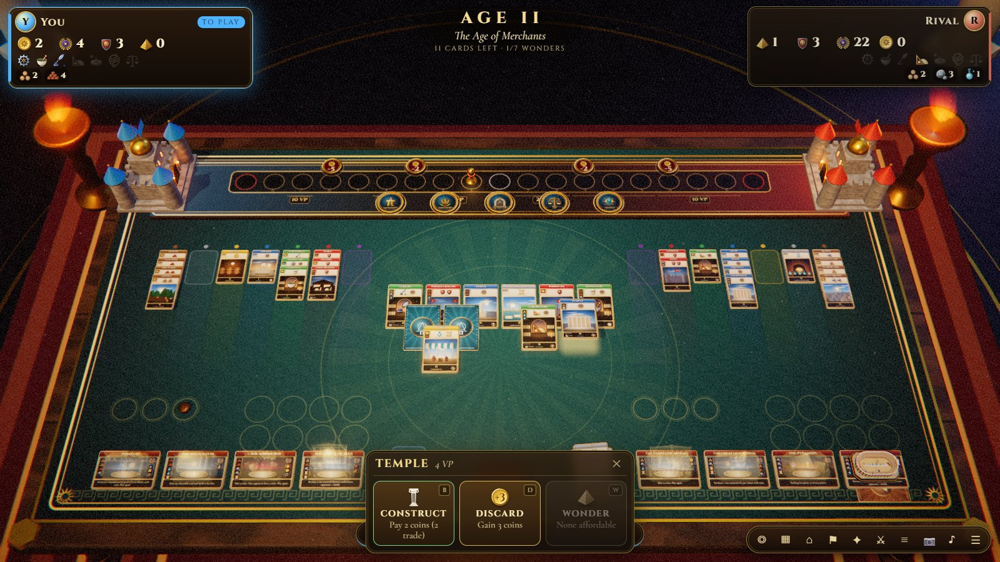
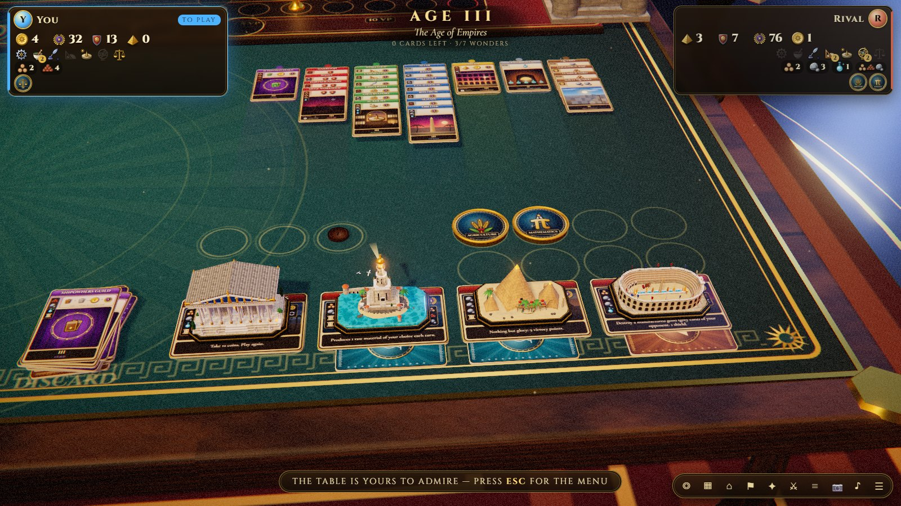
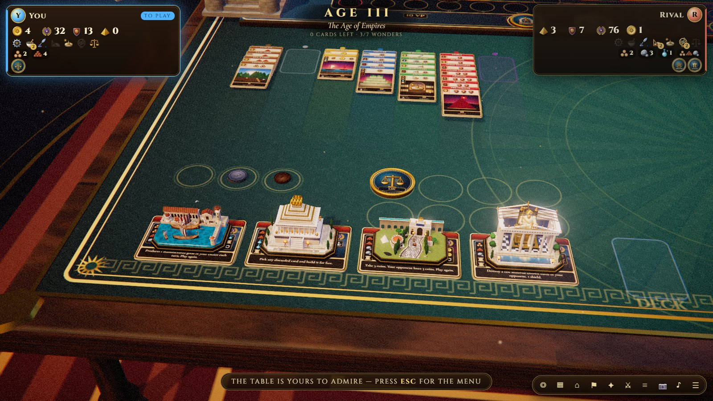
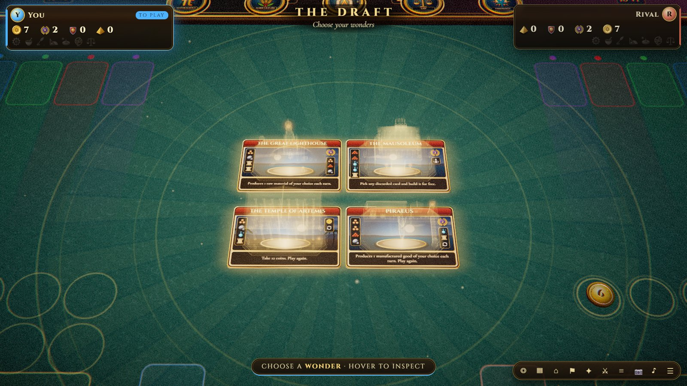
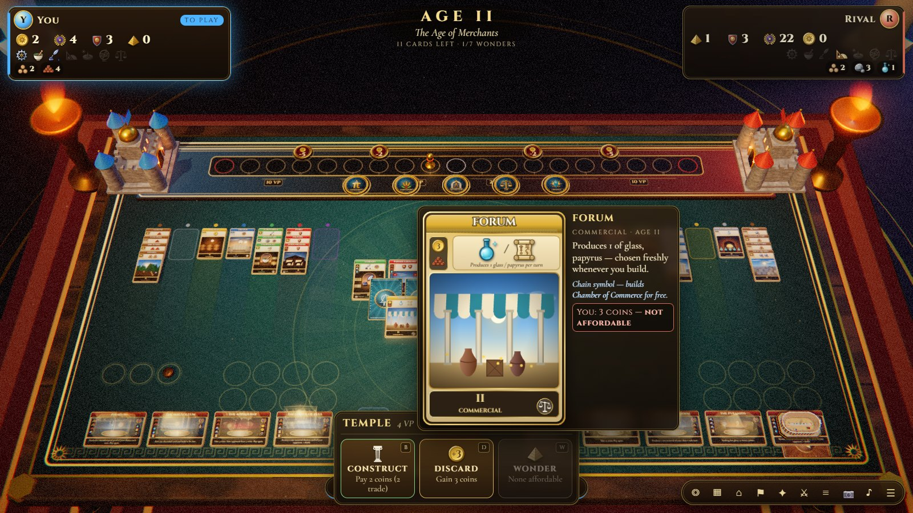
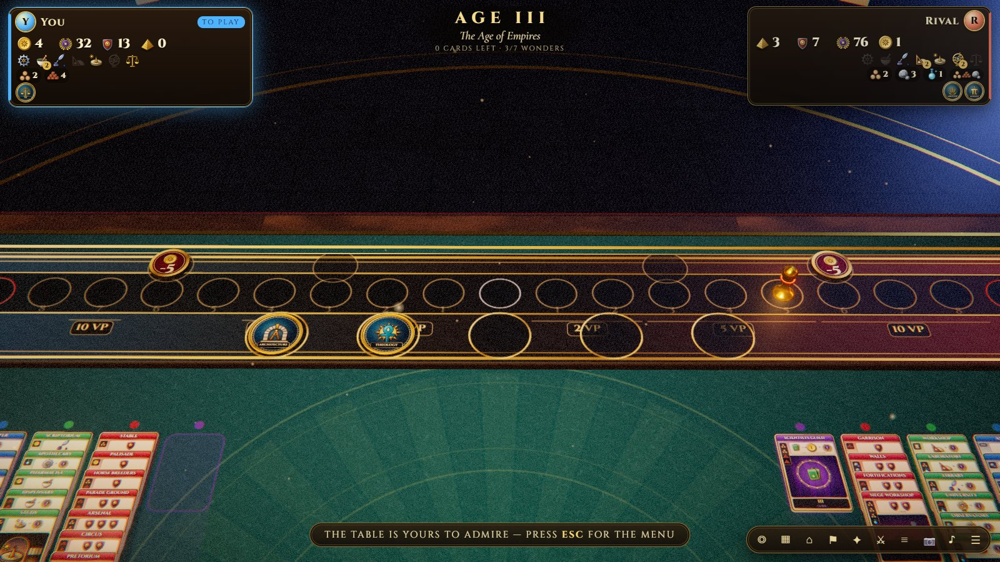
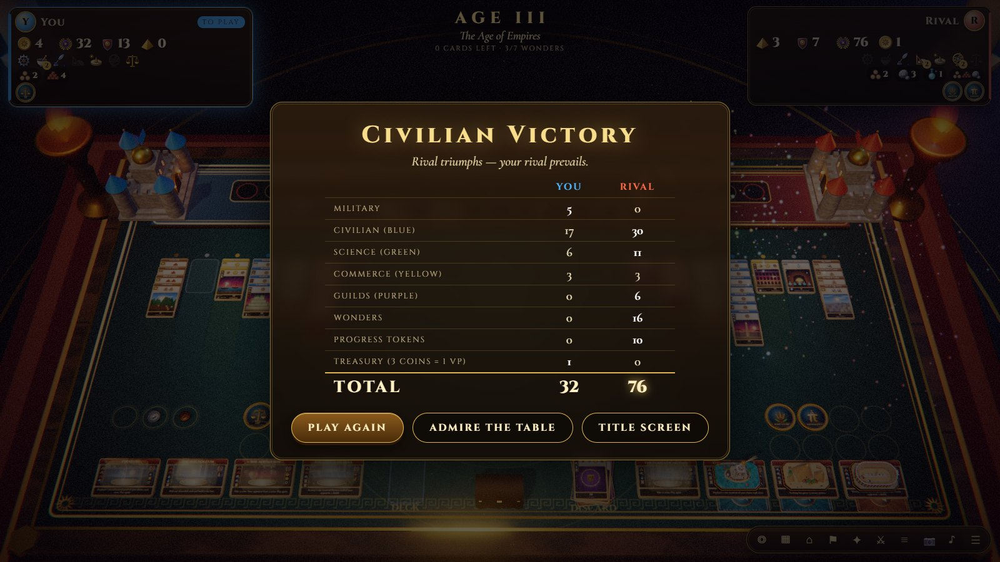

<div align="center">

# Seven Wonders · Duel — a 3D tribute

[](https://1amthis.github.io/seven-wonders-duel-3d/)

[](https://github.com/1amthis/seven-wonders-duel-3d/actions/workflows/deploy.yml)
[](https://threejs.org)
[](https://esbuild.github.io)



<a href="docs/teaser.mp4"></a>

**[▶ Watch the teaser in full quality](docs/teaser.mp4)** (13 s, silent)

</div>

A complete, playable, fully-3D digital version of the two-player card game *7 Wonders Duel*, built with
Three.js. Everything you see and hear — the table, the cards and their illustrations, the twelve wonder
miniatures, the coins, the sky, the music and the sound effects — is **generated procedurally in the
browser**: there is not a single image, model or audio file in the project.

> Fan-made tribute. Not affiliated with or endorsed by the publishers of *7 Wonders Duel*.

## A closer look

<table>
  <tr>
    <td width="50%"></td>
    <td width="50%"></td>
  </tr>
  <tr>
    <td colspan="2"><b>Wonders rise from their cards.</b> Each of the twelve is a procedural miniature that appears in a burst of
    light when you construct it, and some come alive: the Circus Maximus races chariots and the triremes of Piraeus bob
    on the water.</td>
  </tr>
  <tr>
    <td></td>
    <td></td>
  </tr>
  <tr>
    <td><b>The draft.</b> Four wonders are dealt at a time, each with a holographic ghost of the monument it will become.</td>
    <td><b>Every card explains itself.</b> Hover anything for a large view, the full effect, chain information and <i>your exact cost</i>, trading included.</td>
  </tr>
  <tr>
    <td></td>
    <td></td>
  </tr>
  <tr>
    <td><b>Military supremacy.</b> The conflict pawn hops along a gilded track and looting tokens burst; push it into
    your rival's capital, or collect six different science symbols, and the duel ends on the spot.</td>
    <td><b>The final count.</b> After Age III, every category of victory point is tallied, with the leader in each highlighted.</td>
  </tr>
</table>

The screenshots come from a real match played in the built game; the two wonder shots and the military track are
staged on a finished table (seven wonders raised, the pawn advanced) to show everything at once.

## Play it

* **Online:** <https://1amthis.github.io/seven-wonders-duel-3d/> — free, in your browser, no install or sign-up.
* **Offline:** run `npm install && npm run build`, then double-click `dist/seven-wonders-duel-3d.html` — a
  single self-contained file (fonts, code and everything else inlined). No server needed.
* **Dev server:** `npm install && npm run dev` → <http://localhost:5173>
* **Production build:** `npm run build` (writes `dist/`)

Every push to `main` runs the tests and redeploys the site through GitHub Actions
(`.github/workflows/deploy.yml`); pull requests run the tests and a build (`test.yml`).

Best in a recent Chrome / Edge / Firefox with hardware WebGL 2. Graphics quality (High / Medium / Low) and
animation speed are in *Settings*; a laptop iGPU should use Medium or Low.

## Play a friend online

Pick **Opponent → Online** in the menu, then either:

* **Host a duel:** you get a five-letter room code and an invite link. Send either to your friend and the duel starts
  as soon as they join.
* **Join a duel:** open your friend's link (it goes straight to the join screen) or type their code.

There is no account and no game server. The two browsers connect directly (WebRTC, through the free public
[PeerJS](https://peerjs.com) matchmaking server and its free relays for strict networks) and each one runs the whole
game: the only things sent are the seed and names at the start and then every move. The rules engine is deterministic,
so both copies stay identical, and each move carries a hash of the resulting state so that any drift is noticed and
repaired from the host's copy. The host picks who begins and the seed; "Rematch" asks the other player and swaps the
starter.

It is built to survive real networks: a dropped connection is re-dialled automatically and the two sides reconcile their
move logs, so a move made while offline is not lost. If you **reload the tab**, or your phone throws the page away in the
background, the duel is saved in the tab's session storage and you are offered to resume it (the guest's invite link
rejoins on its own while the host's tab is still open). Leaving on purpose tells the other player; a dropped connection
only shows a "slow" / "offline" badge on their panel. Names typed by the other player are stripped of markup, and a
move is only accepted if it is legal for the seat it came from.

Good to know: it needs a network that allows WebRTC (almost all do), anyone who has the code can take the empty seat, and
a determined player could peek at face-down cards with the browser's dev tools, which is fine between friends.

## What's in the box

* **The full rules** — wonder draft (4 + 4, 1-2-2-1 / 2-1-1-2 order), the three Age structures with
  face-up / face-down cards and proper covering, all 73 buildings (incl. 7 guilds, 3 drawn per game),
  the 12 wonders and 10 progress tokens, chain building, trading prices (2 + the rival's brown/grey
  production, 1-coin reserves, Customs House), Masonry/Architecture discounts, Economy, Urbanism,
  Theology, Strategy, the conflict pawn with looting tokens and military zones, science pairs, scientific
  and military supremacy, the "weakest military chooses who opens the next Age" rule, the 7-wonder cap,
  Mausoleum / Great Library / Circus Maximus / Statue of Zeus interactions, end scoring and tie-breaks.
* **Play against** a computer opponent (three levels), a friend on the same screen (hot-seat), a friend
  **online** on their own computer or phone, or just **watch two AIs** duel.
* **A table worth looking at** — felt play-mat with embroidered zones, carved wooden frame with gold inlay,
  a gilded military track with two citadels and a bronze conflict pawn, flickering braziers, a night sky
  with a moon, embers and dust motes, ACES tone-mapping, bloom, soft shadows and a filmic grade.
* **Procedural card art** — every building has its own illustration, cost column, effect plate and chain
  symbols; wonder cards stand on a plinth under a holographic ghost of the monument…
* **…which becomes a real miniature when built**: Pyramids, Great Library, Hanging Gardens, Colossus,
  Temple of Artemis, Lighthouse, Mausoleum, Sphinx, Circus Maximus (racing chariots), Piraeus (bobbing
  triremes), Statue of Zeus and the Appian Way rise from their cards with a burst of light.
* **Living feedback** — coins fly between treasuries, the pawn hops along the track, looting tokens burst,
  destroyed cards crumble, progress tokens glitter, banners announce each Age.
* **Synthesised audio** — Web-Audio foley for every action plus an endless generative "oud and drone"
  soundtrack that gets tense when someone is close to winning.
* **Tooltips everywhere** — hover any card, wonder or token for a large view, the full effect text, chain
  information and *your exact cost* including trading.

## Controls

| Action | How |
| --- | --- |
| Pick a card | click a glowing card in the pyramid → choose **Construct / Discard / Wonder** in the dock (keys `B` `D` `W`) |
| Use a card for a wonder | with a card selected, click a glowing wonder on your side |
| Camera | drag = orbit · right-drag = pan · wheel = zoom · `1`–`6` presets (overview, pyramid, your city, rival city, wonders, military) |
| Log / sound / menu | `L` / `M` / `Esc` |

**On a phone or tablet** the same game plays with a finger: tap a glowing card and pick an action in the bar that
appears, *press and hold* a card, wonder or token to read it (the tooltip lets go when you do), drag to orbit, pinch to
zoom and drag with two fingers to pan. Tap a player's panel to open their science, resources and progress tokens. The
layout adapts to portrait and landscape; in portrait the camera frames the card pyramid instead of the whole table.

## Project layout

```
src/engine/   rules.js (pure, JSON-state rules engine) · data.js (cards, wonders, tokens) · ai.js · describe.js
src/gfx/      stage.js (renderer, post-fx, camera) · view.js (state → 3D + choreography) · table.js · env.js
              cardart.js / scenes.js / glyphs.js (procedural art) · wonders3d.js (12 miniatures) · fx.js
src/ui/       hud.js · dialogs.js · icons.js        src/audio.js  procedural sound & music
src/game.js   controller wiring engine ↔ AI ↔ 3D ↔ HUD
src/net/      protocol.js (room codes, move validation, MatchSync: the deterministic two-copy sync; no network, unit-tested)
              room.js (PeerJS link: heartbeat, reconnection) · online.js (game-side controller, session saving)
src/ui/lobby.js  host / join / resume dialogs
tests/        engine.test.mjs (rules + self-play), net.test.mjs (online sync), seo.test.mjs (page metadata), tune.mjs (AI weight tuning), headless UI scenarios
site.mjs      HTML shell: meta tags, structured data, crawlable text, sitemap (used by build.mjs)
public/       static files copied into dist/ (link-preview image, favicons)      docs/screenshots/  README images
```

`npm test` runs the rules engine through 300 random games plus AI-vs-AI games and unit checks on costs, plays whole
duels between two simulated online players over a link that drops and reconnects (`tests/net.test.mjs`), then
checks the page's SEO basics (title and description length, one `<h1>`, canonical and social tags, icons, sitemap).
`tests/*.mjs` scenario scripts drive the real UI in headless Edge/Chrome through `puppeteer-core`.
`npm run test:online` (after `npm run build`) opens two headless browsers that really connect over WebRTC through a local
signalling server, plays moves on both, drops the connection, reloads each tab and plays a match through to a rematch.
`npm run test:mobile` (dev server on :5173) walks the game on emulated phones and tablets and fails if the HUD or a dialog
leaves the screen, text is clipped, touch targets are too small, panels overlap, or a tap, press-and-hold or pinch misbehaves.
The README screenshots and the link-preview image are generated by `npm run build && node tests/docshots.mjs`,
which plays a full match against the built game in headless Edge. `node tests/teaser.mjs` renders the teaser
(`docs/teaser.mp4` and `.gif`) frame by frame on a virtual clock and encodes it with ffmpeg.

## Credits

Game design of *7 Wonders Duel*: Antoine Bauza & Bruno Cathala (Repos Production). This project only
re-implements the publicly documented rules; all artwork, models and sounds here are original and
procedurally generated. Fonts: Cinzel and Cormorant Garamond (SIL OFL) via Fontsource.

## License

The code is released under the [ISC license](LICENSE). *7 Wonders Duel* itself belongs to its authors and publishers.
